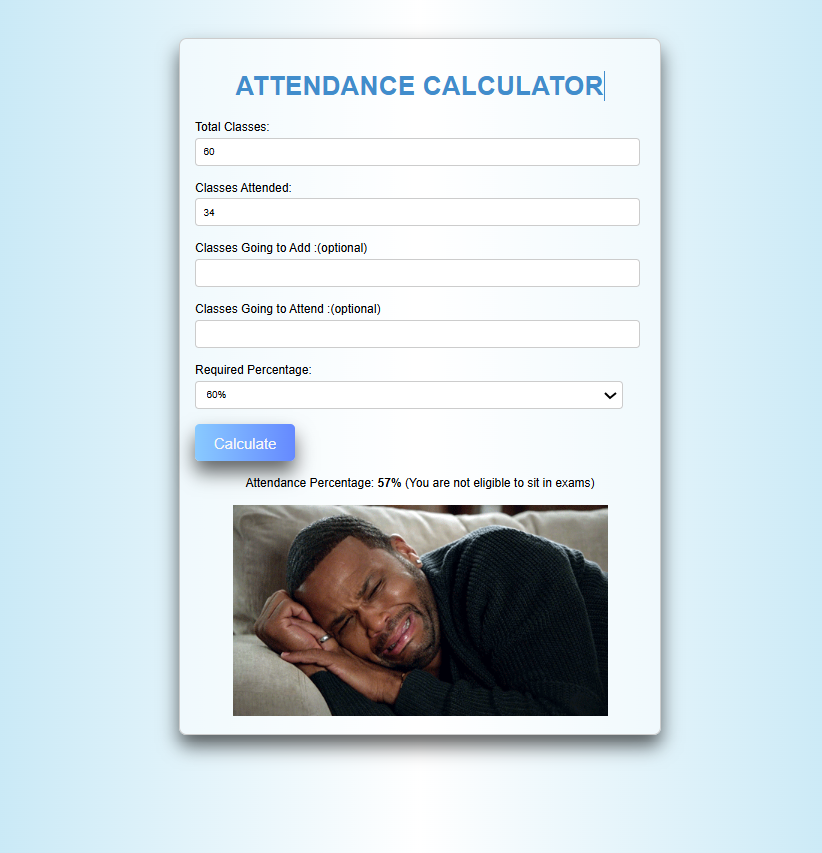

# 📊 Attendance Calculator

A responsive and interactive web application designed to help students easily calculate and monitor their attendance percentage. Built using **HTML**, **CSS**, and **JavaScript**, this project demonstrates clean code, user-friendly interface, and thoughtful design.

---

## 📖 About the Project

Attendance is an important part of academic life, and keeping track of it can be challenging. The **Attendance Calculator** simplifies this process by allowing users to input:

- Total classes
- Classes attended
- Optional future classes and attendance

It calculates the attendance percentage and provides visual feedback using GIFs. The application is interactive, visually appealing, and responsive across devices.

---

## 🚀 Key Features

- **Interactive Form:** Enter current and future classes for accurate calculations.
- **Real-Time Feedback:** Instant calculation with input validation.
- **Custom Thresholds:** Choose required attendance percentage from 60% to 100%.
- **Typing Animation:** Animated page title for engaging UI.
- **Visual Feedback:** Shows fun GIFs based on results.
- **Responsive Design:** Works on different screen sizes.

---
## 📷 Screenshots

### 🏠 Home Page
Here’s how the Attendance Calculator looks when you first open it:


---

### ✅ After Calculating Attendance
This is the result view after entering values and clicking "Calculate":



---

### ✅ 1. Get the Project Files

There are two ways to download or copy the files:

- **Clone with Git:**  
  Use this command in your terminal or command prompt to download the files:  
  ```bash
  git clone https://github.com/your-username/attendance-calculator.git
